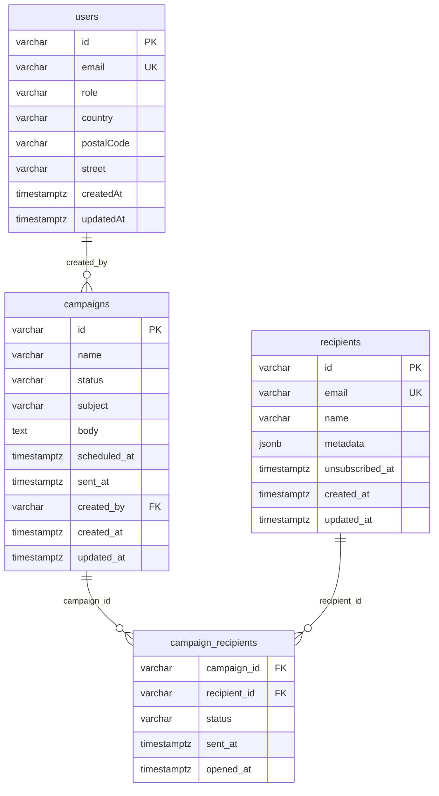

# Database Schema — Campaign Management System

> Lead Database Engineer Design Document  
> PostgreSQL · Raw DDL · Constraints · Indexes · Triggers · TDD Verification

---

## Table of Contents

- [Database Schema — Campaign Management System](#database-schema--campaign-management-system)
  - [Table of Contents](#table-of-contents)
  - [Entity Relationship Diagram](#entity-relationship-diagram)
  - [DDL — Table Definitions](#ddl--table-definitions)
    - [`users` (existing)](#users-existing)
    - [`campaigns`](#campaigns)
    - [`recipients`](#recipients)
    - [`campaign_recipients`](#campaign_recipients)
  - [Triggers](#triggers)
    - [`set_campaign_updated_at`](#set_campaign_updated_at)
    - [`check_campaign_scheduled_at_future`](#check_campaign_scheduled_at_future)
  - [Indexing Strategy](#indexing-strategy)
    - [Index Trade-off Analysis](#index-trade-off-analysis)
      - [`idx_campaigns_status` — `campaigns(status)`](#idx_campaigns_status--campaignsstatus)
      - [`idx_campaigns_scheduled_active` — `campaigns(scheduled_at) WHERE status = 'scheduled'`](#idx_campaigns_scheduled_active--campaignsscheduled_at-where-status--scheduled)
      - [`idx_cr_recipient_id` — `campaign_recipients(recipient_id)`](#idx_cr_recipient_id--campaign_recipientsrecipient_id)
      - [`idx_cr_campaign_status` — `campaign_recipients(campaign_id, status)`](#idx_cr_campaign_status--campaign_recipientscampaign_id-status)
  - [TDD Verification Script](#tdd-verification-script)
  - [Business Rules Summary](#business-rules-summary)

---

## Entity Relationship Diagram



---

## Concept Clarity — Entity Relationships

**Users, Recipients, and Campaigns are three distinct, separate concepts:**

- **User** = System account (login subject). Stored in the pre-existing `users` table.
- **Recipient** = Campaign contact (email address). Stored in `recipients` table. **Has NO FK to users.**
- **Campaign** = Marketing email created by a User. Stored in `campaigns` table. **Only User is linked to Campaign via FK (`campaigns.created_by → users.id`).**

**The relationship chain:**
1. A **User** creates one or more **Campaigns** (`campaigns.created_by → users.id`, FK with RESTRICT on delete)
2. A **Recipient** is a global contact; can be enrolled in multiple campaigns
3. A **Campaign** + **Recipient** are linked **only** via the `campaign_recipients` junction table
4. No direct FK exists between `users` and `recipients`

Deleting a User whose campaigns exist is **BLOCKED** by the FK constraint (`ON DELETE RESTRICT`).  
Deleting a Campaign cascades to its `campaign_recipients` rows (`ON DELETE CASCADE`).

---

## DDL — Table Definitions

### `users` (existing)

The `users` table is pre-existing. Campaigns reference it via `created_by`. No DDL
changes are required; the existing migration
`db/migrations/20260423225644_create_users_table.sql` defines this table.

```sql
-- For reference only — already migrated
CREATE TABLE "users" (
  "id"          VARCHAR        NOT NULL,
  "email"       VARCHAR        NOT NULL,
  "role"        VARCHAR        NOT NULL,
  "country"     VARCHAR        NOT NULL,
  "postalCode"  VARCHAR        NOT NULL,
  "street"      VARCHAR        NOT NULL,
  "createdAt"   TIMESTAMPTZ    NOT NULL DEFAULT now(),
  "updatedAt"   TIMESTAMPTZ    NOT NULL DEFAULT now(),
  CONSTRAINT "UQ_users_email"   UNIQUE  ("email"),
  CONSTRAINT "PK_users_id"      PRIMARY KEY ("id")
);
```

---

### `campaigns`

Stores campaign metadata and tracks lifecycle state through a constrained status
column. The `scheduled_at` future-date rule is enforced by a `BEFORE INSERT`
trigger rather than a plain `CHECK` because `CHECK` expressions that call
`now()` evaluate once per statement — a trigger is the correct tool for
row-level temporal invariants on insert.

```sql
CREATE TABLE campaigns (
  id           VARCHAR(36)  NOT NULL,
  name         VARCHAR(255) NOT NULL,
  status       VARCHAR(20)  NOT NULL DEFAULT 'draft',
  subject      VARCHAR(500) NOT NULL,
  body         TEXT         NOT NULL,
  scheduled_at TIMESTAMPTZ  NULL,
  sent_at      TIMESTAMPTZ  NULL,
  created_by   VARCHAR(36)  NOT NULL,
  created_at   TIMESTAMPTZ  NOT NULL DEFAULT now(),
  updated_at   TIMESTAMPTZ  NOT NULL DEFAULT now(),

  CONSTRAINT pk_campaigns_id
    PRIMARY KEY (id),

  CONSTRAINT fk_campaigns_created_by
    FOREIGN KEY (created_by)
    REFERENCES users (id)
    ON DELETE RESTRICT,

  -- Closed-set status values enforced at DB level.
  -- Application layer must mirror these values exactly.
  CONSTRAINT chk_campaigns_status
    CHECK (status IN (
      'draft',
      'scheduled',
      'active',
      'paused',
      'completed',
      'cancelled'
    )),

  -- sent_at is only meaningful once the campaign leaves 'draft'/'scheduled'.
  CONSTRAINT chk_campaigns_sent_at_requires_non_draft
    CHECK (
      sent_at IS NULL
      OR status IN ('active', 'paused', 'completed', 'cancelled')
    )
);
```

**Column notes:**

| Column         | Type         | Nullable | Default   | Business rule                                     |
| -------------- | ------------ | -------- | --------- | ------------------------------------------------- |
| `id`           | VARCHAR(36)  | NO       | —         | Application-generated UUID                        |
| `name`         | VARCHAR(255) | NO       | —         | Human-readable label                              |
| `status`       | VARCHAR(20)  | NO       | `'draft'` | Must be one of the 6 allowed values               |
| `subject`      | VARCHAR(500) | NO       | —         | Email subject line                                |
| `body`         | TEXT         | NO       | —         | Email body (HTML or plain text)                   |
| `scheduled_at` | TIMESTAMPTZ  | YES      | NULL      | Must be future-dated on INSERT (trigger-enforced) |
| `sent_at`      | TIMESTAMPTZ  | YES      | NULL      | Set by scheduler when sending begins              |
| `created_by`   | VARCHAR(36)  | NO       | —         | FK → `users.id`; RESTRICT prevents orphaning      |
| `created_at`   | TIMESTAMPTZ  | NO       | `now()`   | Immutable after insert                            |
| `updated_at`   | TIMESTAMPTZ  | NO       | `now()`   | Maintained by `set_campaign_updated_at` trigger   |

---

### `recipients`

Independent of campaigns — a recipient can exist in the system before being
added to any campaign. The `UNIQUE` constraint on `email` prevents duplicate
subscriber records at the database level.

```sql
CREATE TABLE recipients (
  id              VARCHAR(36)   NOT NULL,
  email           VARCHAR(320)  NOT NULL,
  name            VARCHAR(255)  NOT NULL,
  metadata        JSONB         NULL,
  unsubscribed_at TIMESTAMPTZ   NULL,
  created_at      TIMESTAMPTZ   NOT NULL DEFAULT now(),
  updated_at      TIMESTAMPTZ   NOT NULL DEFAULT now(),

  CONSTRAINT pk_recipients_id
    PRIMARY KEY (id),

  -- Prevents duplicate subscriber records without application-level dedup logic.
  CONSTRAINT uq_recipients_email
    UNIQUE (email),

  -- A recipient cannot be both subscribed (unsubscribed_at IS NULL) and
  -- simultaneously have a future unsubscribe date — guard against bad updates.
  CONSTRAINT chk_recipients_unsubscribed_at_not_future
    CHECK (
      unsubscribed_at IS NULL
      OR unsubscribed_at <= now()
    )
);
```

**Column notes:**

| Column            | Type         | Nullable | Default | Business rule                        |
| ----------------- | ------------ | -------- | ------- | ------------------------------------ |
| `id`              | VARCHAR(36)  | NO       | —       | Application-generated UUID           |
| `email`           | VARCHAR(320) | NO       | —       | RFC 5321 max length; UNIQUE enforced |
| `name`            | VARCHAR(255) | NO       | —       | Display name                         |
| `metadata`        | JSONB        | YES      | NULL    | Arbitrary subscriber attributes      |
| `unsubscribed_at` | TIMESTAMPTZ  | YES      | NULL    | Non-null means unsubscribed          |

---

### `campaign_recipients`

Junction table that tracks the per-recipient delivery status within a campaign.
Both FKs use `ON DELETE CASCADE` so deleting a campaign or recipient
automatically purges the associated delivery records — no dangling rows.

```sql
CREATE TABLE campaign_recipients (
  campaign_id  VARCHAR(36)  NOT NULL,
  recipient_id VARCHAR(36)  NOT NULL,
  status       VARCHAR(20)  NOT NULL DEFAULT 'pending',
  sent_at      TIMESTAMPTZ  NULL,
  opened_at    TIMESTAMPTZ  NULL,

  -- Composite PK eliminates duplicate (campaign, recipient) pairs.
  -- Also acts as a covering index for campaign-first lookups.
  CONSTRAINT pk_campaign_recipients
    PRIMARY KEY (campaign_id, recipient_id),

  CONSTRAINT fk_cr_campaign_id
    FOREIGN KEY (campaign_id)
    REFERENCES campaigns (id)
    ON DELETE CASCADE,

  CONSTRAINT fk_cr_recipient_id
    FOREIGN KEY (recipient_id)
    REFERENCES recipients (id)
    ON DELETE CASCADE,

  -- Closed-set delivery status values.
  CONSTRAINT chk_cr_status
    CHECK (status IN (
      'pending',
      'sent',
      'failed',
      'bounced',
      'opened',
      'clicked'
    )),

  -- sent_at must be set before opened_at can be set.
  CONSTRAINT chk_cr_opened_requires_sent
    CHECK (
      opened_at IS NULL
      OR sent_at IS NOT NULL
    )
);
```

**Column notes:**

| Column         | Type        | Nullable | Default     | Business rule                            |
| -------------- | ----------- | -------- | ----------- | ---------------------------------------- |
| `campaign_id`  | VARCHAR(36) | NO       | —           | FK → `campaigns.id`; CASCADE on delete   |
| `recipient_id` | VARCHAR(36) | NO       | —           | FK → `recipients.id`; CASCADE on delete  |
| `status`       | VARCHAR(20) | NO       | `'pending'` | Must be one of the 6 allowed values      |
| `sent_at`      | TIMESTAMPTZ | YES      | NULL        | Timestamp of individual delivery attempt |
| `opened_at`    | TIMESTAMPTZ | YES      | NULL        | Requires `sent_at` to be non-null        |

---

## Triggers

### `set_campaign_updated_at`

Fires **BEFORE UPDATE** on `campaigns`. Sets `updated_at` to the current
transaction timestamp so that every modification is automatically timestamped
without relying on application code to pass the value.

```sql
CREATE OR REPLACE FUNCTION fn_set_updated_at()
  RETURNS TRIGGER
  LANGUAGE plpgsql
AS $$
BEGIN
  NEW.updated_at := now();
  RETURN NEW;
END;
$$;

CREATE TRIGGER set_campaign_updated_at
  BEFORE UPDATE ON campaigns
  FOR EACH ROW
  EXECUTE FUNCTION fn_set_updated_at();
```

**Why a shared function?**  
`fn_set_updated_at()` is reusable — the same function can be attached to
`recipients` or any future table that needs `updated_at` maintenance.

---

### `check_campaign_scheduled_at_future`

Fires **BEFORE INSERT** on `campaigns`. Raises a descriptive exception if
`scheduled_at` is provided but falls in the past or is the current moment.

```sql
CREATE OR REPLACE FUNCTION fn_check_scheduled_at_future()
  RETURNS TRIGGER
  LANGUAGE plpgsql
AS $$
BEGIN
  IF NEW.scheduled_at IS NOT NULL AND NEW.scheduled_at <= now() THEN
    RAISE EXCEPTION
      'scheduled_at must be a future timestamp, got: %', NEW.scheduled_at
      USING ERRCODE = 'check_violation';
  END IF;
  RETURN NEW;
END;
$$;

CREATE TRIGGER check_campaign_scheduled_at_future
  BEFORE INSERT ON campaigns
  FOR EACH ROW
  EXECUTE FUNCTION fn_check_scheduled_at_future();
```

**Why a trigger instead of a CHECK constraint?**  
`CHECK (scheduled_at > now())` appears to work but is unsafe: PostgreSQL
evaluates `now()` once at constraint-definition time in some plan shapes, and
the constraint can also be bypassed by `SET CONSTRAINTS DEFERRED`. A `BEFORE
INSERT` trigger guarantees row-level evaluation at the exact moment of
insertion.

---

## Indexing Strategy

```sql
-- 1. Campaigns filtered by status (most common query pattern)
CREATE INDEX idx_campaigns_status
  ON campaigns (status);

-- 2. Composite partial index — scheduler polling pattern
--    Tighter than idx_campaigns_status for the specific scheduler query:
--    SELECT * FROM campaigns WHERE scheduled_at <= now() AND status = 'scheduled'
CREATE INDEX idx_campaigns_scheduled_active
  ON campaigns (scheduled_at)
  WHERE status = 'scheduled';

-- 3. Reverse lookup: which campaigns did a recipient appear in?
--    The composite PK (campaign_id, recipient_id) does NOT satisfy
--    recipient-first scans — this index is non-redundant and required.
CREATE INDEX idx_cr_recipient_id
  ON campaign_recipients (recipient_id);

-- 4. campaign_recipients filtered by delivery status
--    Supports: SELECT * FROM campaign_recipients WHERE campaign_id = ? AND status = 'failed'
CREATE INDEX idx_cr_campaign_status
  ON campaign_recipients (campaign_id, status);
```

### Index Trade-off Analysis

#### `idx_campaigns_status` — `campaigns(status)`

| Dimension         | Detail                                                                                                                                                                                             |
| ----------------- | -------------------------------------------------------------------------------------------------------------------------------------------------------------------------------------------------- |
| **Query benefit** | Enables fast `WHERE status = ?` filters (e.g. dashboards listing all 'active' campaigns).                                                                                                          |
| **Cardinality**   | Low (6 distinct values). PostgreSQL's planner may skip the index for large tables if a status value accounts for >10–15% of rows, falling back to a sequential scan.                               |
| **Write cost**    | One additional B-tree page write per `INSERT` or `UPDATE status`. Negligible at campaign scale (campaigns are infrequently created relative to reads).                                             |
| **Refinement**    | Replace with per-status partial indexes (`WHERE status = 'active'`) for targeted, high-volume queries. The partial index is physically smaller and faster but requires one index per status value. |

#### `idx_campaigns_scheduled_active` — `campaigns(scheduled_at) WHERE status = 'scheduled'`

| Dimension         | Detail                                                                                                                                                                    |
| ----------------- | ------------------------------------------------------------------------------------------------------------------------------------------------------------------------- |
| **Query benefit** | Covers the scheduler's polling query exactly — only indexes rows where work is pending, keeping the index tiny as campaigns move out of 'scheduled'.                      |
| **Cardinality**   | High within the partial set (timestamps are unique). B-tree range scans are highly efficient.                                                                             |
| **Write cost**    | Only rows in 'scheduled' status are indexed; rows in other statuses add zero overhead. Rows are removed from the index the moment `status` changes away from 'scheduled'. |
| **Refinement**    | This is already the production-grade form. A plain index on `scheduled_at` without the predicate would be larger and slower.                                              |

#### `idx_cr_recipient_id` — `campaign_recipients(recipient_id)`

| Dimension          | Detail                                                                                                                                                                                                   |
| ------------------ | -------------------------------------------------------------------------------------------------------------------------------------------------------------------------------------------------------- |
| **Query benefit**  | Critical for reverse-lookup queries: "show me all campaigns this recipient was part of", "did this recipient already receive this campaign type?".                                                       |
| **Non-redundancy** | The composite PK `(campaign_id, recipient_id)` covers forward lookups (given a campaign, find all recipients). It does NOT satisfy backward scans starting from `recipient_id`. This index is mandatory. |
| **Write cost**     | One additional B-tree write per `INSERT` into `campaign_recipients`. At high-volume sends (millions of recipients per campaign), this matters — batch inserts should be used.                            |
| **Refinement**     | If unsubscribe checks are common (`WHERE recipient_id = ? AND status != 'bounced'`), extend to a composite index `(recipient_id, status)`.                                                               |

#### `idx_cr_campaign_status` — `campaign_recipients(campaign_id, status)`

| Dimension                    | Detail                                                                                                                                                                                                                    |
| ---------------------------- | ------------------------------------------------------------------------------------------------------------------------------------------------------------------------------------------------------------------------- |
| **Query benefit**            | Covers compound filters: `WHERE campaign_id = ? AND status = 'failed'` for retry logic, `WHERE campaign_id = ? AND status = 'opened'` for analytics.                                                                      |
| **Covers PK leading column** | This index overlaps with the PK's leading `campaign_id` column. The planner will prefer the PK for pure `campaign_id = ?` filters; this index only wins when `status` is also in the predicate.                           |
| **Write cost**               | One B-tree write per `INSERT` or `status` update in `campaign_recipients`. At bulk-send scale this is the highest-cost index in the schema — evaluate whether per-campaign status analytics queries justify the overhead. |
| **Refinement**               | Make it a partial index `WHERE status IN ('failed', 'bounced')` if retry/failure queries dominate the workload.                                                                                                           |

---

## TDD Verification Script

Run this script against a freshly migrated database to confirm that all
constraints and triggers are operational. Each block is wrapped in a
`DO ... EXCEPTION` block so failures print the expected error code and message
rather than aborting the session.

```sql
-- =============================================================================
-- TDD VERIFICATION SCRIPT
-- Campaign Management Schema — Constraint & Trigger Assertions
-- Expected: all 5 blocks below raise controlled errors; no unexpected successes.
-- =============================================================================

-- Seed data: a valid user, campaign, and recipient used by passing tests
INSERT INTO users (id, email, role, country, "postalCode", street)
VALUES
  ('usr-001', 'owner@example.com', 'admin', 'US', '10001', '1 Main St');

INSERT INTO campaigns (id, name, status, subject, body, created_by,
                       scheduled_at)
VALUES (
  'camp-001',
  'Welcome Series',
  'scheduled',
  'Welcome to our platform',
  '<p>Hello!</p>',
  'usr-001',
  now() + interval '1 hour'   -- valid: 1 hour in the future
);

INSERT INTO recipients (id, email, name)
VALUES ('rec-001', 'alice@example.com', 'Alice');


-- ---------------------------------------------------------------------------
-- TEST 1: Invalid campaign status
-- Expected: ERROR 23514 — check_violation on chk_campaigns_status
-- ---------------------------------------------------------------------------
DO $$
BEGIN
  INSERT INTO campaigns (id, name, status, subject, body, created_by)
  VALUES (
    'camp-bad-status',
    'Bad Status Campaign',
    'INVALID_STATUS',   -- not in the allowed set
    'Subject',
    'Body',
    'usr-001'
  );
  RAISE NOTICE 'TEST 1 FAILED — insert should have been rejected';
EXCEPTION
  WHEN check_violation THEN
    RAISE NOTICE 'TEST 1 PASSED — invalid status rejected (SQLSTATE: %)', SQLSTATE;
END;
$$;


-- ---------------------------------------------------------------------------
-- TEST 2: Orphaned campaign_recipient (non-existent campaign_id)
-- Expected: ERROR 23503 — foreign_key_violation on fk_cr_campaign_id
-- ---------------------------------------------------------------------------
DO $$
BEGIN
  INSERT INTO campaign_recipients (campaign_id, recipient_id, status)
  VALUES (
    'does-not-exist',   -- no matching row in campaigns
    'rec-001',
    'pending'
  );
  RAISE NOTICE 'TEST 2 FAILED — insert should have been rejected';
EXCEPTION
  WHEN foreign_key_violation THEN
    RAISE NOTICE 'TEST 2 PASSED — orphaned campaign_recipient rejected (SQLSTATE: %)', SQLSTATE;
END;
$$;


-- ---------------------------------------------------------------------------
-- TEST 3: scheduled_at in the past (trigger enforcement)
-- Expected: SQLSTATE P0001 — RAISE EXCEPTION from fn_check_scheduled_at_future
-- ---------------------------------------------------------------------------
DO $$
BEGIN
  INSERT INTO campaigns (id, name, status, subject, body, created_by,
                         scheduled_at)
  VALUES (
    'camp-past-schedule',
    'Past Scheduled Campaign',
    'scheduled',
    'Subject',
    'Body',
    'usr-001',
    now() - interval '1 day'   -- explicitly in the past
  );
  RAISE NOTICE 'TEST 3 FAILED — insert should have been rejected';
EXCEPTION
  WHEN check_violation THEN
    RAISE NOTICE 'TEST 3 PASSED — past scheduled_at rejected (SQLSTATE: %)', SQLSTATE;
END;
$$;


-- ---------------------------------------------------------------------------
-- TEST 4: Invalid campaign_recipients status
-- Expected: ERROR 23514 — check_violation on chk_cr_status
-- ---------------------------------------------------------------------------
DO $$
BEGIN
  INSERT INTO campaign_recipients (campaign_id, recipient_id, status)
  VALUES (
    'camp-001',
    'rec-001',
    'INVALID_DELIVERY_STATUS'   -- not in the allowed set
  );
  RAISE NOTICE 'TEST 4 FAILED — insert should have been rejected';
EXCEPTION
  WHEN check_violation THEN
    RAISE NOTICE 'TEST 4 PASSED — invalid cr status rejected (SQLSTATE: %)', SQLSTATE;
END;
$$;


-- ---------------------------------------------------------------------------
-- TEST 5: updated_at trigger on campaigns
-- Expected: updated_at value changes after UPDATE; created_at is unchanged
-- ---------------------------------------------------------------------------
DO $$
DECLARE
  v_created_at  TIMESTAMPTZ;
  v_updated_at_before TIMESTAMPTZ;
  v_updated_at_after  TIMESTAMPTZ;
BEGIN
  SELECT created_at, updated_at
    INTO v_created_at, v_updated_at_before
    FROM campaigns
   WHERE id = 'camp-001';

  -- Small sleep to ensure clock advances
  PERFORM pg_sleep(0.01);

  UPDATE campaigns
     SET name = 'Welcome Series — Updated'
   WHERE id = 'camp-001';

  SELECT updated_at
    INTO v_updated_at_after
    FROM campaigns
   WHERE id = 'camp-001';

  IF v_updated_at_after > v_updated_at_before THEN
    RAISE NOTICE 'TEST 5 PASSED — updated_at advanced from % to %',
      v_updated_at_before, v_updated_at_after;
  ELSE
    RAISE NOTICE 'TEST 5 FAILED — updated_at did not advance (before: %, after: %)',
      v_updated_at_before, v_updated_at_after;
  END IF;

  -- Verify created_at was not mutated
  IF v_created_at = (SELECT created_at FROM campaigns WHERE id = 'camp-001') THEN
    RAISE NOTICE 'TEST 5b PASSED — created_at is immutable';
  ELSE
    RAISE NOTICE 'TEST 5b FAILED — created_at was mutated unexpectedly';
  END IF;
END;
$$;


-- ---------------------------------------------------------------------------
-- TEST 6: opened_at without sent_at (guard constraint)
-- Expected: ERROR 23514 — check_violation on chk_cr_opened_requires_sent
-- ---------------------------------------------------------------------------
DO $$
BEGIN
  INSERT INTO campaign_recipients
    (campaign_id, recipient_id, status, sent_at, opened_at)
  VALUES (
    'camp-001',
    'rec-001',
    'opened',
    NULL,                           -- sent_at not set
    now()                           -- opened_at set — violates constraint
  );
  RAISE NOTICE 'TEST 6 FAILED — insert should have been rejected';
EXCEPTION
  WHEN check_violation THEN
    RAISE NOTICE 'TEST 6 PASSED — opened_at without sent_at rejected (SQLSTATE: %)', SQLSTATE;
END;
$$;


-- ---------------------------------------------------------------------------
-- Cleanup seed data
-- ---------------------------------------------------------------------------
DELETE FROM campaign_recipients WHERE campaign_id = 'camp-001';
DELETE FROM campaigns WHERE id = 'camp-001';
DELETE FROM recipients WHERE id = 'rec-001';
DELETE FROM users WHERE id = 'usr-001';
```

---

## Business Rules Summary

| Rule                                           | Enforcement mechanism                     | Location                                               |
| ---------------------------------------------- | ----------------------------------------- | ------------------------------------------------------ |
| Campaign status is one of 6 allowed values     | `CHECK (status IN (...))`                 | `campaigns.chk_campaigns_status`                       |
| `scheduled_at` must be in the future on insert | `BEFORE INSERT` trigger                   | `fn_check_scheduled_at_future`                         |
| `sent_at` only set for non-draft campaigns     | `CHECK` constraint                        | `campaigns.chk_campaigns_sent_at_requires_non_draft`   |
| Campaign creator must be a valid user          | `FOREIGN KEY ... ON DELETE RESTRICT`      | `campaigns.fk_campaigns_created_by`                    |
| Recipient email is globally unique             | `UNIQUE` constraint                       | `recipients.uq_recipients_email`                       |
| `unsubscribed_at` cannot be a future date      | `CHECK` constraint                        | `recipients.chk_recipients_unsubscribed_at_not_future` |
| Campaign–recipient pair is unique              | `PRIMARY KEY (campaign_id, recipient_id)` | `campaign_recipients.pk_campaign_recipients`           |
| Junction row FK integrity (campaign side)      | `FOREIGN KEY ... ON DELETE CASCADE`       | `campaign_recipients.fk_cr_campaign_id`                |
| Junction row FK integrity (recipient side)     | `FOREIGN KEY ... ON DELETE CASCADE`       | `campaign_recipients.fk_cr_recipient_id`               |
| Delivery status is one of 6 allowed values     | `CHECK (status IN (...))`                 | `campaign_recipients.chk_cr_status`                    |
| `opened_at` requires `sent_at` to be set       | `CHECK` constraint                        | `campaign_recipients.chk_cr_opened_requires_sent`      |
| `updated_at` always reflects last mutation     | `BEFORE UPDATE` trigger                   | `fn_set_updated_at`                                    |
