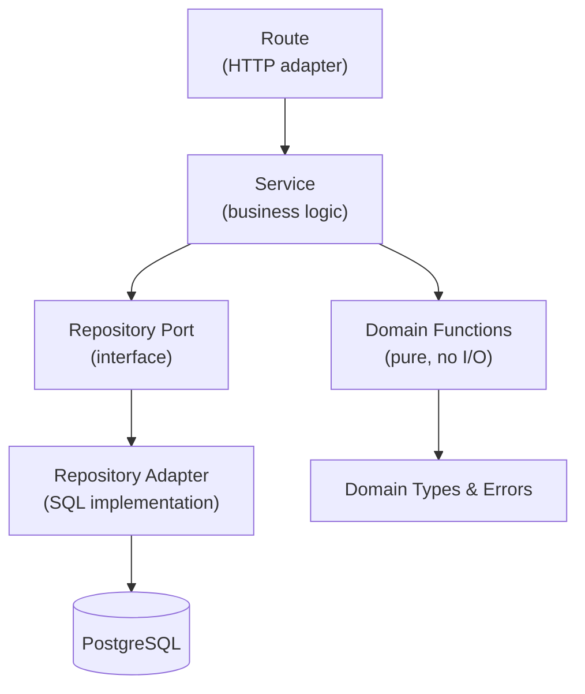
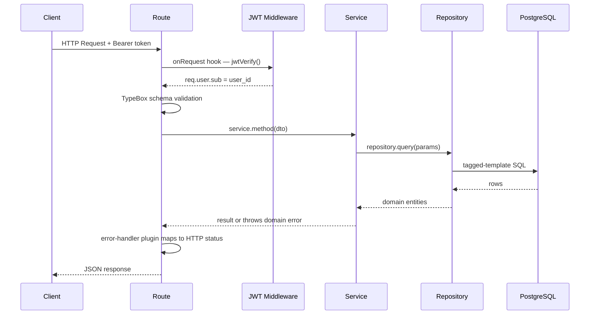
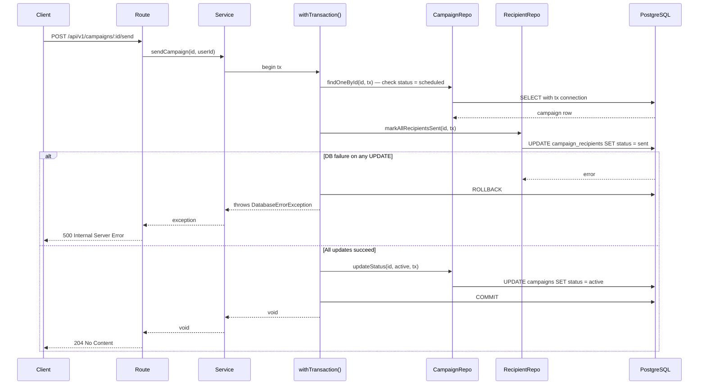
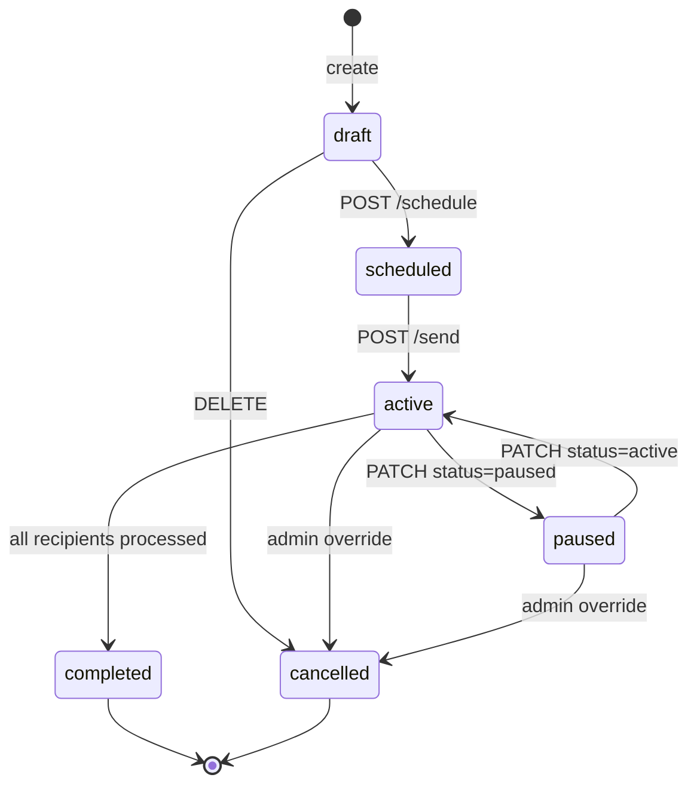

# System Architecture — Campaign Management System

> Fastify 5 · Clean Architecture · DDD · Functional Programming  
> TypeScript strict mode · ESM-only · Node >= 24 · postgres.js

---

## Table of Contents

1. [Architectural Principles](#architectural-principles)
2. [Project Structure](#project-structure)
3. [Layer Boundaries](#layer-boundaries)
4. [Request Lifecycle](#request-lifecycle)
5. [Dependency Injection](#dependency-injection)
6. [Module Inventory](#module-inventory)
7. [Module Anatomy](#module-anatomy)
8. [Database Architecture](#database-architecture)
9. [Stats Endpoint — Aggregation Pattern](#stats-endpoint--aggregation-pattern)
10. [Error Handling](#error-handling)
11. [Observability](#observability)

---

## Architectural Principles

|| Principle | Application |
||---|---|
|| **Dependency inversion** | Services depend on repository *ports* (interfaces), never on repository adapters directly |
|| **Vertical slices** | Each feature module is self-contained — commands, queries, domain, DB, DTOs in one folder |
|| **Functional composition** | No classes for business logic; factory functions receive dependencies via a single `Dependencies` object |
|| **No ORMs** | All SQL is written explicitly in `*.repository.ts` files using postgres.js tagged template literals |
|| **Strict TypeScript** | `strict: true`, `noImplicitAny: true`; no `any`, no `enum` |
|| **Single direction** | Data flows inward: `Route → Service → Repository → PostgreSQL` |

---

## Project Structure

```
fastify-server/
├── src/
│   ├── instrumentation.ts          ← OpenTelemetry setup (--import before app)
│   ├── index.ts                    ← Entry point
│   ├── config/
│   │   ├── env.ts                  ← Zod-validated environment variables
│   │   └── index.ts
│   ├── modules/                    ← Feature code (vertical slices)
│   │   ├── app-module.ts           ← Registers all routes/resolvers
│   │   ├── index.ts
│   │   ├── user/                   ← Exists: reference implementation
│   │   ├── recipient/              ← In Progress: TDD spec, not yet wired
│   │   ├── campaign/               ← Planned
│   │   └── auth/                   ← Planned
│   ├── server/
│   │   ├── index.ts                ← Fastify instance setup
│   │   ├── di/
│   │   │   ├── index.ts            ← Awilix container wiring
│   │   │   └── util.ts
│   │   └── plugins/
│   │       ├── error-handler.ts
│   │       ├── gql.ts              ← Mercurius GraphQL
│   │       ├── request-context.ts
│   │       ├── swagger.ts
│   │       └── jwt-auth.ts         ← Planned
│   └── shared/
│       ├── api/                    ← Base response shapes, paginated DTOs
│       ├── app/                    ← Request context (AsyncLocalStorage)
│       ├── db/
│       │   ├── postgres.ts         ← getDb(), closeDbConnection(), withTransaction()
│       │   ├── repository.port.ts  ← RepositoryPort<Entity> interface
│       │   └── sql-repository.base.ts ← Generic CRUD base
│       ├── ddd/
│       │   ├── mapper.interface.ts ← Mapper<Domain, DbRecord, Response>
│       │   └── query.base.ts
│       ├── exceptions/
│       │   ├── exception-base.ts
│       │   ├── exceptions.ts
│       │   └── index.ts
│       └── utils/
├── db/
│   ├── migrations/                 ← DBMate SQL files
│   └── seeds/
└── tests/
    ├── shared/
    ├── support/
    │   ├── server.ts               ← buildApp() for test instances
    │   ├── custom-world.ts
    │   └── common-hooks.ts
    └── <feature>/
        ├── *.feature               ← Cucumber/Gherkin scenarios
        └── <feature>.steps.ts
```

---

## Layer Boundaries

The dependency arrow flows **strictly inward**. Outer layers may import inner
layers; inner layers never import outer layers.



**Hard rules:**
- `*.service.ts` files **never** import from `src/shared/db/` or `database/` adapters
- SQL belongs exclusively in `*.repository.ts` files
- Business logic belongs exclusively in `*.service.ts` and `*.domain.ts` files
- Routes handle HTTP concerns only: parse request, call service, send response

---

## Request Lifecycle

### Authenticated REST request



### Transactional send request



---

## Dependency Injection

DI uses [Awilix](https://github.com/jeffijoe/awilix) with `@fastify/awilix`.

### Registration flow

```
src/server/di/index.ts
  └─ makeDependencies({ logger })
       ├─ registers: db, logger, repositoryBase
       └─ auto-loads from src/modules/**/*.{repository,mapper,service,domain}.ts
            → kebab-case filename → camelCase DI key
               e.g. campaign.service.ts → campaignService
                    user.repository.ts  → userRepository
```

### Declaring module dependencies

Each module's `index.ts` extends the global `Dependencies` interface:

```typescript
// src/modules/campaign/index.ts
import type makeCampaignService from '#src/modules/campaign/campaign.service.ts';
import type makeCampaignRepository from '#src/modules/campaign/database/campaign.repository.ts';

declare global {
  export interface Dependencies {
    campaignService: ReturnType<typeof makeCampaignService>;
    campaignRepository: ReturnType<typeof makeCampaignRepository>;
  }
}
```

### Consuming dependencies in routes

```typescript
handler: async (req, res) => {
  const id = await fastify.diContainer.cradle.campaignService.createCampaign(req.body);
  return res.status(201).send({ id });
},
```

---

## Module Inventory

|| Module | Phase | Commands | Queries | Status |
||---|---|---|---|---|
|| `user` | — | create-user, delete-user | find-users | **Exists** |
|| `recipient` | 2–3 | create, delete | find-recipients | **In Progress** (folder & TDD spec exist, not yet wired) |
|| `campaign` | 4–5 | create, patch-status, delete, schedule, send | find-campaigns, get-stats | Planned |
|| `auth` | 6 | register, login | — | Planned |

### Domain Concepts

The system manages three distinct entities:

| Concept | Role | Storage | Example |
|---------|------|---------|---------|
| **User** | System account; owns campaigns; authenticates via JWT | `users` table (pre-existing) | "alice@company.com" signs up and creates campaigns |
| **Campaign** | Email communication created by a User; targets Recipients | `campaigns` table (FK to User via `created_by`) | "Winter Sale" campaign scheduled for Jan 15 |
| **Recipient** | Campaign contact; receives emails; **NOT a User** | `recipients` table (**NO FK to users**) | "customer@gmail.com" enrolled in campaigns |

**Critical distinction:** No FK exists between `users` and `recipients`. Recipients are independent contact records, never system accounts.

---

### Campaign status machine



**Guard in `campaign.service.ts`:** `PATCH` and `DELETE` throw `ConflictException`
if `status !== 'draft'`. The DB `CHECK` constraint acts as a second line of defence
on the status column itself.

---

## Module Anatomy

Every module follows the same vertical slice structure. The `user` module is the
canonical reference implementation.

```
src/modules/<feature>/
├── commands/
│   └── <action>/
│       ├── <action>.route.ts       HTTP handler + Fastify route registration
│       ├── <action>.schema.ts      TypeBox body/response schemas
│       └── <action>.graphql-schema.ts   (optional)
├── queries/
│   └── <query>/
│       ├── <query>.route.ts
│       ├── <query>.schema.ts
│       └── <query>.graphql-schema.ts    (optional)
├── database/
│   ├── <feature>.repository.port.ts    interface extends RepositoryPort<Entity>
│   └── <feature>.repository.ts         SQL implementation
├── domain/
│   ├── <feature>.domain.ts         factory + pure business functions
│   ├── <feature>.domain.spec.ts    unit tests
│   ├── <feature>.types.ts          Entity type, CreateProps, UpdateProps
│   └── <feature>.errors.ts         domain-specific exceptions
├── dtos/
│   ├── <feature>.response.dto.ts
│   └── <feature>.paginated.response.dto.ts
├── <feature>.mapper.ts             toPersistence / toDomain / toResponse
├── <feature>.service.ts            all business logic methods
└── index.ts                        declare global Dependencies
```

### Naming conventions

|| Artifact | Convention | Example |
||---|---|---|
|| File names | `kebab-case` | `campaign.service.ts` |
|| DI keys | `camelCase` (auto-derived) | `campaignService` |
|| Table names | `snake_case` | `campaign_recipients` |
|| TypeBox schemas | `PascalCase` constant | `CreateCampaignBodySchema` |
|| Domain errors | `PascalCase` class | `CampaignAlreadySentError` |
|| Environment variables | `SCREAMING_SNAKE_CASE` | `JWT_SECRET` |

---

## Database Architecture

### Connection management

```typescript
// src/shared/db/postgres.ts
// Lazy singleton — connection is not opened until first query
getDb()              // returns postgres.Sql instance
closeDbConnection()  // graceful shutdown hook

// Parameterized queries (always use tagged templates)
db`SELECT * FROM ${db('campaigns')} WHERE id = ${id}`
//              ↑ identifier interpolation   ↑ value parameterization

// Transactions
await withTransaction(async (tx) => {
  // all queries within tx use the same connection
  await repo.update(id, data, tx);
});
```

### Repository base

`SqlRepositoryBase` (in `src/shared/db/sql-repository.base.ts`) provides:

|| Method | Description |
||---|---|
|| `insert(entity)` | Persists a new domain entity |
|| `findOneById(id)` | Returns entity or throws `NotFoundException` |
|| `findAll(query)` | Returns all matching rows |
|| `findAllPaginated(query)` | Returns `Paginated<Entity>` |
|| `update(id, props)` | Partial update |
|| `delete(id)` | Hard delete, returns `boolean` |

Repositories extend this base and add feature-specific query methods.

### Condition composition

```typescript
// Multi-filter queries use joinConditions() helper
const conditions = joinConditions([
  params.status ? db`status = ${params.status}` : null,
  params.createdBy ? db`created_by = ${params.createdBy}` : null,
]);
// Produces: WHERE status = $1 AND created_by = $2  (or empty if no filters)
```

---

## Stats Endpoint — Aggregation Pattern

`GET /api/v1/campaigns/:id/stats` returns delivery metrics in a single SQL pass.

### Query design

```sql
SELECT
  COUNT(*)                                          AS total,
  COUNT(*) FILTER (WHERE status = 'sent')           AS sent,
  COUNT(*) FILTER (WHERE status = 'failed')         AS failed,
  COUNT(*) FILTER (WHERE status = 'opened')         AS opened,
  ROUND(
    COUNT(*) FILTER (WHERE status = 'opened')::numeric
    / NULLIF(COUNT(*) FILTER (WHERE status = 'sent'), 0) * 100, 2
  )                                                 AS open_rate,
  ROUND(
    COUNT(*) FILTER (WHERE status = 'sent')::numeric
    / NULLIF(COUNT(*), 0) * 100, 2
  )                                                 AS send_rate
FROM campaign_recipients
WHERE campaign_id = $1;
```

**Division-by-zero safety:** `NULLIF(expr, 0)` returns `NULL` when the
denominator is zero. The response DTO maps `NULL → 0.00` so clients always
receive a numeric value.

### Response shape

```typescript
type CampaignStatsResponse = {
  total: number;
  sent: number;
  failed: number;
  opened: number;
  open_rate: number;   // percentage, 2 decimal places; 0 when no sends
  send_rate: number;   // percentage, 2 decimal places; 0 when no recipients
};
```

---

## Error Handling

All domain errors extend `ExceptionBase` from `src/shared/exceptions/`.

|| Exception | HTTP status | Usage |
||---|---|---|
|| `NotFoundException` | 404 | Entity not found by ID |
|| `ConflictException` | 409 | Duplicate or invalid state transition |
|| `ArgumentInvalidException` | 400 | Validation failure in domain layer |
|| `DatabaseErrorException` | 500 | Unexpected DB error |
|| `InternalServerErrorException` | 500 | Unexpected application error |
|| `ProviderErrorException` | 502 | External service failure |

The `error-handler.ts` plugin catches all thrown exceptions and maps them to the
correct HTTP status + JSON body. Route handlers never call `res.status(500)`
directly.

---

## Observability

|| Concern | Tool | Configuration |
||---|---|---|
|| Structured logging | Pino | Injected as `logger` via DI; never use `console.*` |
|| Distributed tracing | OpenTelemetry | `src/instrumentation.ts` loaded via `--import` flag before app start |
|| Request correlation | `request-context.ts` plugin | AsyncLocalStorage stores `requestId` per request |
|| API documentation | `@fastify/swagger` | Auto-generated from TypeBox schemas; served at `/documentation` |
